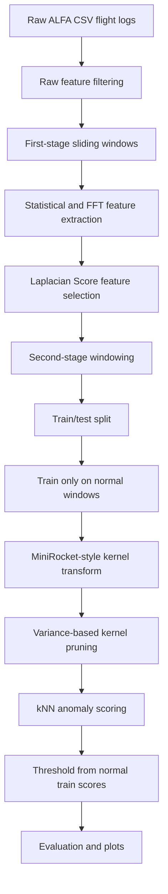

# ALFA Unsupervised UAV Anomaly Detection

<p align="center">
  <b>Unsupervised anomaly detection pipeline for UAV flight-log time series</b><br>
  Feature selection · two-stage windowing · MiniRocket-style kernels · kNN anomaly scoring · baseline comparison
</p>

<p align="center">
  
  
  
  
</p>

---

## 1. Project Overview

This project implements an unsupervised anomaly detection pipeline for UAV flight-log data from the ALFA dataset. The main goal is to train only on normal UAV behavior and detect abnormal flight windows caused by different failure types.

The notebook `ALFA_Unsupervised.ipynb` builds the full pipeline:

1. Load raw ALFA failure logs.
2. Extract statistical and frequency-based features from short windows.
3. Select informative raw features using Laplacian Score.
4. Convert the feature table into fixed-length multivariate time-series samples.
5. Train a MiniRocket-style random convolutional kernel transform on normal data only.
6. Select useful kernels and channels using unsupervised criteria.
7. Score test windows using k-nearest-neighbor distance in the transformed feature space.
8. Compare against distance-based and deep learning baselines.
9. Generate visualizations for rankings, ablations, parameter sweeps, and confusion matrices.

The pipeline is intended for research experimentation rather than production deployment. Some paths are currently hard-coded for Google Drive or a local ALFA dataset folder, so they should be updated before running.

---

## 2. Method Pipeline



---

## 3. Repository / Notebook Structure

| Section | Purpose | Main Components |
|---|---|---|
| MiniRocket implementation | Defines a custom MiniRocket-style transform for multivariate time series | `fit`, `transform`, `_fit_biases`, `_fit_dilations`, `_PPV` |
| Kernel utilities | Groups MiniRocket features by kernel and removes correlated kernels | `kernel_feature_columns`, `kernel_signatures`, `prune_correlated_kernels` |
| Preprocessing | Loads raw ALFA logs, extracts window statistics, and applies Laplacian feature selection | `calc_stat`, `fft_magnitude`, `laplacian_score` |
| Second-stage windowing | Converts the selected feature table into fixed-size tensors | `WINDOW_ROWS = 40`, `STRIDE = 1` |
| Channel selection | Removes weak or redundant channels using unsupervised scores | pseudo-SNR, Spearman redundancy, elbow threshold |
| Main detector | Applies MiniRocket features, kernel pruning, kNN scoring, and thresholding | `NearestNeighbors`, train-score quantile threshold |
| Evaluation | Reports accuracy, precision, recall, F1, AUC, and confusion matrix | `classification_report`, `confusion_matrix`, `roc_auc_score` |
| Sensitivity analysis | Tests key parameters and plots accuracy/runtime trade-offs | number of features, `tau`, threshold quantile, `k` |
| Baselines | Implements simple comparison methods | Euclidean kNN, DTW kNN, LSTM Autoencoder, OmniAnomaly-style model |
| Visualization | Produces figures for research reporting | score rankings, heatmaps, ablation plots, parameter sweeps |

---

## 4. Data Assumptions

The notebook assumes the ALFA dataset is available in a folder similar to:

```text
FaultDetection_ALFA-Dataset-master/
└── failures/
    ├── failure_type_1/
    ├── failure_type_2/
    ├── ...
    └── laplacian_selected_multiclass/
```

The main configurable paths are:

```python
ROOT_FOLDER = "FaultDetection_ALFA-Dataset-master/failures"
OUT_DIR = "FaultDetection_ALFA-Dataset-master/failures/laplacian_selected_multiclass"
CSV_PATH = "FaultDetection_ALFA-Dataset-master/failures/laplacian_selected_multiclass/laplacian_selected_feature_table_multiclass.csv"
```

If running in Google Colab, these paths may need to point to `/content/drive/MyDrive/...`. If running locally, they should point to the local dataset folder.

---

## 5. Main Configuration

### First-stage preprocessing

| Parameter | Default | Meaning |
|---|---:|---|
| `WINDOW_SIZE` | `10` | Number of raw rows per first-stage local window |
| `STRIDE` | `5` | Step size between first-stage windows |
| `TOP_K_RAW_FEATURES` | `12` | Number of raw columns selected by Laplacian Score |
| `LAPLACIAN_SAMPLE_ROWS` | `20000` | Maximum rows sampled for feature scoring |
| `LAPLACIAN_KNN` | `5` | Number of neighbors used in Laplacian Score graph |
| `HEAT_T` | `1.0` | Heat-kernel parameter for graph weights |

### Second-stage windowing

| Parameter | Default | Meaning |
|---|---:|---|
| `WINDOW_ROWS` | `40` | Number of aggregated rows in each model input sample |
| `STRIDE` | `1` | Step between second-stage windows |
| `TEST_SIZE` | `0.2` | Fraction of normal windows placed in the test set |
| `RANDOM_STATE` | `0` | Random seed used for reproducible splitting |

### MiniRocket-kNN detector

| Parameter | Default | Meaning |
|---|---:|---|
| `NUM_FEATURES` | `1000` | Number of MiniRocket features to generate |
| `MAX_DILATIONS` | `32` | Maximum number of dilations per kernel |
| `TAU` | `0.7` | Correlation threshold for kernel pruning |
| `K_NEIGHBORS` | `5` | Number of neighbors used for anomaly scoring |
| `THRESHOLD_QUANTILE` | `0.999` | Train-score quantile used as anomaly threshold |

---

## 6. Feature Extraction

The preprocessing stage converts raw UAV flight logs into a structured feature table. Each selected raw signal is summarized using time-domain and frequency-domain statistics.

### Time-domain statistics

| Feature | Description |
|---|---|
| `p50` | Median value inside the local window |
| `iqr` | Interquartile range |
| `rms` | Root mean square value |
| `slope` | Linear trend over the window |
| `mean_abs_diff` | Mean absolute difference between consecutive points |

### Frequency-domain statistics

The notebook computes the FFT magnitude of each window, then summarizes it using:

| Feature | Description |
|---|---|
| `mean` | Mean FFT magnitude |
| `p25` | First quartile of FFT magnitudes |
| `p50` | Median FFT magnitude |
| `p75` | Third quartile of FFT magnitudes |

---

## 7. Train/Test Protocol

The notebook converts the original multiclass labels into a binary anomaly detection task:

```text
0             -> normal
all other IDs -> anomaly
```

The split follows a one-class anomaly detection setup:

| Split | Content |
|---|---|
| Training set | Normal windows only |
| Test set | Held-out normal windows plus all anomaly windows |

This is important because the detector is trained without labeled anomalies. The anomaly threshold is computed only from the normal training scores.

---

## 8. Main Detection Method

The main detector uses the following logic:

1. Fit the MiniRocket-style transform on normal training windows.
2. Transform both train and test windows into kernel-feature vectors.
3. Group features by kernel.
4. Remove weak or redundant kernels using unsupervised pruning.
5. Fit kNN on transformed normal training features.
6. Score each sample by its average distance to the nearest normal neighbors.
7. Set the anomaly threshold using the selected train-score quantile.
8. Predict a test sample as anomalous if its score exceeds the threshold.

Mathematically, for a test feature vector \(z_i\), the anomaly score is:

```math
s_i = \frac{1}{k}\sum_{j \in \mathcal{N}_k(z_i)} d(z_i, z_j),
```

where \(\mathcal{N}_k(z_i)\) is the set of the \(k\) nearest normal training samples.

The threshold is:

```math
\theta = Q_q(S_{train}),
```

where \(Q_q\) is the selected quantile and \(S_{train}\) contains the normal training scores.

---

## 9. Example Output From the Notebook

One recorded run in the notebook produced the following result after MiniRocket feature extraction, kernel pruning, and kNN anomaly scoring:

| Metric | Value |
|---|---:|
| Accuracy | `0.9747` |
| Normal precision | `0.9713` |
| Normal recall | `0.9840` |
| Anomaly precision | `0.9791` |
| Anomaly recall | `0.9627` |
| Anomaly F1-score | `0.9708` |
| Full features | `924` |
| Kept features | `550` |
| Feature reduction | `40.48%` |

Confusion matrix:

```text
[[2948   48]
 [  87 2247]]
```

These numbers are notebook-run outputs, not fixed benchmark claims. They can change if the dataset version, split, paths, random seeds, or hyperparameters are changed.

---

## 10. Baselines Included

The notebook also includes baseline or comparison models.

| Baseline | Purpose |
|---|---|
| Euclidean kNN | Simple distance-based baseline on raw time-series windows |
| DTW kNN | Elastic distance baseline for time-series alignment |
| Aeon DTW one-class kNN | Faster DTW baseline using a sampled normal reference bank |
| LSTM Autoencoder | Deep reconstruction-based anomaly detector |
| OmniAnomaly-style model | Probabilistic recurrent baseline with latent variables and planar flows |

The DTW baseline is useful as a sanity check, but it can be much slower than the MiniRocket-kNN method. In the recorded notebook output, the Aeon DTW one-class baseline used a reference bank of 300 normal windows and required substantially more runtime.

---

## 11. Installation

Create a Python environment first:

```bash
python -m venv .venv
source .venv/bin/activate      # Linux / macOS
# .venv\Scripts\activate       # Windows PowerShell
```

Install the required packages:

```bash
pip install numpy pandas scipy scikit-learn matplotlib numba aeon torch jupyter
```

For Google Colab, the notebook already includes:

```python
!pip install aeon
```

You may still need to install or upgrade other packages depending on the Colab runtime.

---

## 12. How to Run

### Option A: Run in Google Colab

1. Upload or mount the ALFA dataset.
2. Open `ALFA_Unsupervised.ipynb` in Colab.
3. Update the dataset paths:

```python
ROOT_FOLDER = "/content/drive/MyDrive/path/to/FaultDetection_ALFA-Dataset-master/failures"
OUT_DIR = "/content/drive/MyDrive/path/to/FaultDetection_ALFA-Dataset-master/failures/laplacian_selected_multiclass"
```

4. Run the notebook cells in order.
5. Check the generated CSV, NumPy arrays, metrics, and plots.

### Option B: Run locally

1. Place the ALFA dataset inside the project folder.
2. Start Jupyter:

```bash
jupyter notebook
```

3. Open `ALFA_Unsupervised.ipynb`.
4. Update the paths to match your local folder.
5. Run the notebook from top to bottom.

---

## 13. Generated Files

The notebook saves intermediate and final artifacts such as:

```text
laplacian_selected_feature_table_multiclass.csv
X_laplacian_second_window.npy
y_laplacian_second_window.npy
meta_laplacian_second_window.csv
minirocket_knn_15runs_results.csv
minirocket_knn_median_confusion_matrix.npy
minirocket_knn_median_confusion_matrix.csv
minirocket_knn_variants_results.csv
```

These files make it possible to avoid recomputing every preprocessing step when running later experiments.

---

## 14. Notes and Limitations

- The notebook is exploratory and contains several experiment blocks. Not every cell is required for the main MiniRocket-kNN pipeline.
- Some paths are hard-coded and should be parameterized before turning this into a reusable package.
- The preprocessing and modeling steps are mixed in one notebook. For a cleaner repository, they can be moved into separate Python modules.
- The main detector uses only normal samples for training, which matches the unsupervised / one-class setting.
- The current thresholding strategy depends on a high quantile of normal training scores. This should be tuned carefully when anomaly costs are asymmetric.
- DTW baselines are computationally expensive for large window sets. Sampling a normal reference bank reduces cost but changes the comparison.

---

## 15. Suggested Refactoring

A cleaner project structure would be:

```text
alfa-unsupervised/
├── README.md
├── requirements.txt
├── notebooks/
│   └── ALFA_Unsupervised.ipynb
├── src/
│   ├── preprocessing.py
│   ├── feature_selection.py
│   ├── minirocket_transform.py
│   ├── channel_selection.py
│   ├── anomaly_scoring.py
│   ├── baselines.py
│   └── visualization.py
├── data/
│   └── README.md
└── outputs/
    ├── features/
    ├── models/
    └── figures/
```

This would make the code easier to test, reuse, and cite in a research paper.

---

## 16. Minimal Main Pipeline

For a clean experiment, run only these stages:

```text
1. MiniRocket implementation cells
2. Kernel utility cells
3. Preprocessing and Laplacian feature-selection cell
4. Second-stage windowing cell
5. Channel-selection cell, optional
6. Main MiniRocket-kNN anomaly detector cell
7. Evaluation and confusion-matrix plotting cells
```

The sensitivity analysis, ablation studies, and deep baselines can be run after the main pipeline is verified.

---

## 17. Citation / Method Context

This notebook uses random convolutional kernel ideas inspired by MiniRocket-style time-series transforms and adapts them for one-class UAV anomaly detection. The main experimental logic is based on transforming multivariate UAV windows into kernel features, reducing the feature space, and applying distance-based anomaly scoring.

